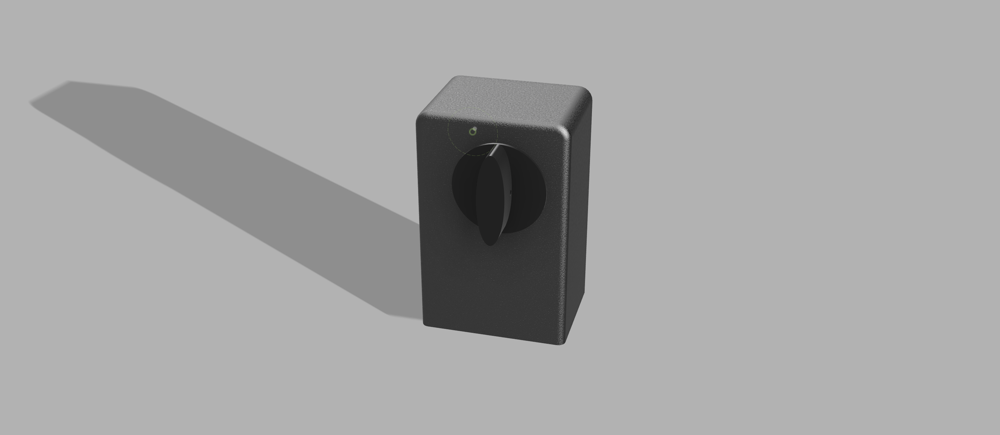

# KeyLess-entry
Repo Containing Keyless entry code, 3D files and the works

### Kelyless Entry for our building's door
Out main building door is old and we're lazy, we have a pattern that we buzz our apartment with to unlock the door.
An ESP32 is continueously looking for that pattern, once we do the right pattern `5 clicks within 2s and then one click after 3s` it engages a relay that unlocks out building door. We're definetly planning to add a BLE layer to it for further auth, but we're running into some logistical challenge that prevents us from doing so. But we'll have it soon.

### Kelyless Entry for our apartment door

I designed a automatic door latch opener (Check the CAD files). You latch should look like [this](https://github.com/user-attachments/assets/1c7db39d-d5bf-440c-9e52-779d17a7e265) to work.

Use these parts:
- Bearings https://a.co/d/dRyna11
- Motors https://a.co/d/atU4r7z

I'm planning to use (touch based) door knob tap as an unlock trigger and BLE for authentication to finally unlock my apartment door.

